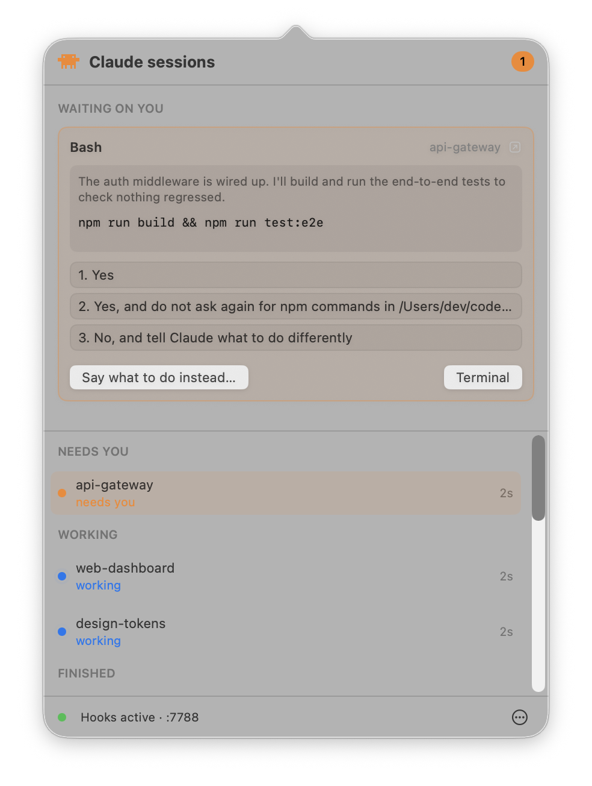
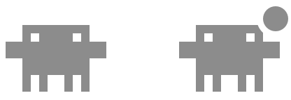

<h1 align="center">Permission Relay</h1>

<p align="center">Answer Claude Code's permission prompts from your menu bar.</p>

<p align="center">
  
</p>

Permission Relay puts every Claude Code session in one menu bar panel. When one of
them stops to ask permission, you answer it there instead of going looking for its
terminal tab.

The buttons come from the menu Claude has drawn in that terminal, so they're the
same options that session is offering. Below them you get the rest of your
sessions and what each one is doing, and clicking any of them brings its tab to
the front.

It's a native Swift app with no dependencies, and it only ever talks to Claude
Code over a loopback port.

## Install

You'll need macOS 14 or later, [iTerm2](https://iterm2.com), and Claude Code.

```sh
git clone https://github.com/FlorisVeldhuizen/claude-menubar.git
cd claude-menubar
./scripts/build-app.sh --install
```

Clawd, the crab Claude Code prints in your terminal, appears in your menu bar.
Click it and press **Install hooks**.

Sessions you already have running show up straight away.

## Use it



A dot appears on the crab when a session needs you.

The card up top is the session that's waiting. Press one of Claude's own options,
or **Say what to do instead…** to send a message back. **Terminal** takes you to
that tab.

`⌘1`–`⌘9` pick the numbered options, `⌘K` opens the message field, and `⌘[` /
`⌘]` hop between projects when more than one is waiting.

Below the card is every live session and what it's up to. Click a quiet one to
jump to it.

The **⋯** menu holds the alert sound, **Open at login**, and the rest of the
settings.

## Good to know

Apple Terminal works, but the app is built around iTerm2 and a few things are
rougher there. Sessions in VS Code or another terminal still show up, and you can
still answer them. Those get an **Always allow** button standing in for Claude's
own "don't ask again", which remembers that one command for that one project.

## Built with Claude Code

Almost all of this was written by Claude Code, which is also the thing it exists
to make easier.

## Licence

MIT
